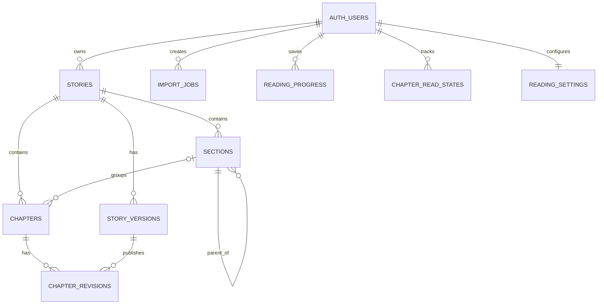

# Đặc tả sản phẩm (PRD) — Kệ Đọc
### Nền tảng đọc bản thảo cá nhân cho tác giả/dịch giả

| | |
|---|---|
| **Phiên bản** | v0.2 — Implementation-ready MVP |
| **Ngày** | 11/07/2026 |
| **Người phụ trách** | Jarvis (solo) |
| **Trạng thái** | Ready for implementation |
| **Thay thế** | PRD v0.1 |

---

## 0. Tóm tắt quyết định v0.2

V0.2 chốt các quyết định từng để mở ở v0.1:

1. MVP là **responsive web**, ưu tiên đọc trên điện thoại; chưa cam kết cài đặt PWA hoặc đọc offline.
2. MVP dùng **một phương thức đăng nhập: Google OAuth**.
3. Mọi tác phẩm **Private mặc định và bắt buộc** trong MVP. Unlisted/Public chưa có.
4. MVP hỗ trợ import `.docx`, `.txt` UTF-8 và paste toàn bộ văn bản. `.md` để sau.
5. Nội dung MVP là **text-first**: giữ đoạn văn, hard line break, in đậm, in nghiêng và dấu ngắt cảnh; không nhập ảnh, bình luận, footnote, header/footer hoặc font nhúng.
6. Cấu trúc đọc hỗ trợ tối đa: **Quyển (tùy chọn) → Hồi/Phần (tùy chọn) → Chương**. Tác phẩm có thể chỉ gồm các Chương.
7. Sửa trong app chỉ là **sửa cấu trúc import và metadata**: đổi tên, đổi loại, gộp/tách ở ranh giới đoạn, sắp xếp và ánh xạ chương. Không sửa văn xuôi.
8. **Re-import thủ công vào tác phẩm hiện có là P0**, nhằm cập nhật bản thảo mà không làm mất chapter ID, trạng thái đã đọc hoặc vị trí đọc.
9. Tiến độ đọc được neo theo **đoạn văn ổn định**, không theo pixel hoặc phần trăm scroll thô.
10. Theme, cỡ chữ và line-height được giữ trong P0 vì đã có trong prototype và phục vụ trực tiếp trải nghiệm đọc.

## 1. Bối cảnh và vấn đề

Jarvis viết hoặc dịch truyện trên máy tính, lưu bản thảo trong Google Drive/Google Docs/Word rồi đọc lại trên điện thoại để kiểm tra nhịp truyện như một độc giả thật.

Google Docs tối ưu cho soạn thảo, không tối ưu cho đọc dài:

- Bố cục mang cảm giác tài liệu văn phòng.
- Khó tùy chỉnh typography cho từng thiết bị.
- Dễ mất dấu đang ở Quyển/Hồi/Chương nào.
- Khó nhảy nhanh giữa hàng trăm chương.
- Việc khôi phục vị trí đọc không đáng tin cậy sau khi bố cục thay đổi.

Ngoài ra, bản thảo là nội dung đang thay đổi. Một sản phẩm chỉ hỗ trợ import lần đầu sẽ không thay thế được Google Docs: người dùng phải có thể re-import bản mới mà không tạo bản sao tác phẩm và không mất tiến độ cũ.

## 2. Tầm nhìn sản phẩm

Kệ Đọc là “bản đọc” riêng tư của bản thảo: người dùng tiếp tục viết ở công cụ quen thuộc, đưa bản mới vào Kệ Đọc trong vài phút, rồi đọc trên điện thoại với cảm giác của một ứng dụng ebook.

Kệ Đọc không cố trở thành trình soạn thảo, mạng xã hội truyện hoặc kho xuất bản công khai.

## 3. Mục tiêu và kết quả mong muốn

### 3.1 Mục tiêu P0

1. Từ một file bản thảo thật đến màn hình đọc trên điện thoại trong **dưới 2 phút** đối với trường hợp chuẩn.
2. Người đọc luôn nhận biết được tác phẩm, Quyển/Hồi và Chương hiện tại mà không phải cuộn về đầu.
3. Từ bất kỳ vị trí nào, người đọc mở mục lục trong một thao tác và đến chương đích trong vài giây.
4. Đóng ứng dụng rồi mở lại sẽ trở về đúng đoạn đang đọc, kể cả sau khi đổi cỡ chữ, line-height hoặc thiết bị.
5. Re-import bản cập nhật giữ được chapter ID, trạng thái đã đọc và vị trí đọc cho các chương được ánh xạ.
6. Nội dung bản thảo không thể được đọc bởi người dùng khác hoặc qua URL công khai.

### 3.2 Chỉ số thành công MVP

| Chỉ số | Mục tiêu |
|---|---:|
| Median từ lúc chọn file đến lúc mở Reader | < 2 phút |
| Import thành công với DOCX fixture chuẩn | ≥ 95% lần chạy |
| Chương nhận diện đúng không cần sửa với heading chuẩn | ≥ 95% |
| Khôi phục đúng đoạn hoặc lệch tối đa 1 đoạn | ≥ 95% |
| Nhảy đến một chương đã biết từ Reader | ≤ 5 giây ở p90 |
| Re-import giữ đúng chapter ID cho chương được tự động match | 100% |
| Sau 30 ngày pilot | Không còn dùng Google Docs làm giao diện đọc chính |

Các chỉ số là mục tiêu pilot cá nhân, không phải chỉ số tăng trưởng SaaS.

## 4. Người dùng và Jobs to Be Done

### 4.1 Persona P0

Tác giả/dịch giả tự đọc lại bản thảo của chính mình trên máy tính và điện thoại. MVP tối ưu cho một người dùng nhưng kiến trúc không được phá vỡ khả năng có nhiều tài khoản sau này.

### 4.2 Jobs to Be Done

- Khi vừa có bản thảo hoặc bản cập nhật mới, tôi muốn đưa nó vào Kệ Đọc nhanh để không phải chia lại từng chương.
- Khi parser hiểu sai cấu trúc, tôi muốn sửa ranh giới và thứ tự mà không phải chỉnh văn xuôi.
- Khi đang đọc giữa một truyện dài, tôi muốn luôn biết mình ở đâu và nhảy đến bất kỳ chương nào nhanh chóng.
- Khi quay lại sau vài giờ hoặc vài ngày, tôi muốn tiếp tục đúng đoạn đã dừng.
- Khi re-import bản đã sửa, tôi muốn giữ nguyên lịch sử đọc ở những phần vẫn còn tương ứng.

## 5. Phạm vi

### 5.1 P0 — MVP

- Google OAuth.
- Thư viện nhiều tác phẩm và nút Đọc tiếp.
- Tạo tác phẩm bằng DOCX, TXT UTF-8 hoặc paste toàn bộ nội dung.
- Parser heading/pattern và bước ánh xạ cấp heading.
- Preview cấu trúc trước khi commit.
- Đổi tên metadata, đổi loại section, gộp/tách tại ranh giới đoạn, sắp xếp.
- Re-import vào tác phẩm hiện có, diff và xác nhận mapping.
- Reader responsive, hierarchy cố định, mục lục nhanh, chương trước/sau.
- Cỡ chữ, line-height, theme sáng/tối/sepia.
- Lưu và đồng bộ tiến độ theo paragraph anchor.
- Trạng thái chưa đọc/đang đọc/đã đọc theo từng chương.
- Private-by-default, RLS, sanitize nội dung và giới hạn file.
- Trạng thái import, cảnh báo và phục hồi lỗi không phá dữ liệu hiện có.

### 5.2 P1 — Fast follow

- Tìm kiếm trong tác phẩm.
- Font family bổ sung.
- Ghi chú/highlight.
- Unlisted sharing.
- Khôi phục một story version cũ.
- Import Markdown.
- Cài đặt PWA cơ bản.

### 5.3 P2 — Ngoài MVP

- Đồng bộ tự động với Google Drive.
- Offline reading.
- Public library/feed/follow.
- Cộng tác thời gian thực và bình luận nhóm.
- Trình chỉnh sửa văn xuôi.
- Kiểm lỗi ngôn ngữ, thống kê xưng hô hoặc lặp từ.
- App native iOS/Android.
- Ảnh minh họa, footnote và layout DOCX phức tạp.
- Monetization.

## 6. Nguyên tắc sản phẩm

1. **Reader trước, công cụ quản lý sau:** UI đọc không mang theo chrome của màn hình import.
2. **Không bao giờ làm mất bản đang đọc:** import mới chỉ có hiệu lực sau bước xác nhận và commit nguyên tử.
3. **Vị trí là nội dung, không phải pixel:** mọi cơ chế resume phải gắn với paragraph/block.
4. **Private là trạng thái mặc định, không phải một lựa chọn giao diện.**
5. **Parser có thể sai; quy trình sửa phải nhanh và có thể đảo ngược trước commit.**
6. **Tối ưu cho truyện dài:** mọi thiết kế TOC và state phải được kiểm thử với ít nhất 500 chương.

## 7. Mô hình nội dung và thuật ngữ

### 7.1 Cây nội dung P0

```text
Tác phẩm
├── Quyển (tùy chọn, tối đa 1 cấp)
│   ├── Hồi/Phần (tùy chọn, tối đa 1 cấp)
│   │   └── Chương
│   └── Chương
├── Hồi/Phần (khi không có Quyển)
│   └── Chương
└── Chương (khi không có section)
```

- `Quyển`, `Hồi` và `Phần` là các `Section` có type khác nhau.
- `Chương` là leaf node và có kind `regular` hoặc `extra`.
- “Ngoại truyện” được lưu như một Chapter có `kind = extra`, không tạo thêm một tầng cây.
- Nếu Quyển/Hồi/Arc có nội dung trực tiếp mà không có heading Chương, parser tạo một leaf Chapter tổng hợp có cùng title và `is_synthetic = true`; Reader/TOC được phép ẩn title trùng để không tạo hierarchy giả trên giao diện.
- MVP giới hạn tối đa 2 tầng Section để UI, parser và truy vấn có hành vi xác định.

### 7.2 Block nội dung

Mỗi chapter revision lưu nội dung dạng block có cấu trúc thay vì raw HTML:

```json
{
  "schema_version": 1,
  "blocks": [
    {
      "anchor_id": "p_8f17c2_1",
      "type": "paragraph",
      "text": "Nội dung đoạn văn...\nDòng tiếp theo vẫn thuộc cùng đoạn.",
      "marks": [
        { "type": "italic", "start": 0, "end": 12 }
      ]
    },
    {
      "anchor_id": "break_23",
      "type": "scene_break",
      "text": "***",
      "marks": []
    }
  ]
}
```

`anchor_id` được sinh từ fingerprint của nội dung chuẩn hóa, kèm suffix khi trùng. Cùng một đoạn không đổi qua re-import phải nhận cùng fingerprint.

### 7.3 Thuật ngữ versioning

- **Import Draft:** kết quả parse có thể sửa trong màn Review, chưa ảnh hưởng Reader.
- **Story Version:** snapshot bất biến của hierarchy và các chapter revision sau một lần commit thành công.
- **Chapter identity:** ID logic ổn định của một chapter qua đổi tên, đổi vị trí hoặc sửa nội dung.
- **Chapter Revision:** nội dung block bất biến của một chapter; chỉ tạo mới khi nội dung chapter thay đổi.
- **Current Version:** Story Version mà Library/Reader đang phục vụ. Pointer chỉ đổi sau commit nguyên tử.

## 8. Luồng người dùng cốt lõi

### 8.1 Import tác phẩm mới — desktop-first

1. Người dùng đăng nhập.
2. Chọn “Thêm tác phẩm”.
3. Chọn DOCX/TXT hoặc paste toàn bộ nội dung.
4. Hệ thống upload và parse vào một Import Draft; chưa làm thay đổi thư viện.
5. Người dùng xác nhận mapping Heading → Quyển/Hồi/Chương.
6. Hệ thống hiển thị cây được nhận diện, số chương và cảnh báo.
7. Người dùng sửa cấu trúc nếu cần.
8. Người dùng chọn “Hoàn tất import”.
9. Hệ thống commit nguyên tử, tạo Story Version 1 và mở Reader ở chương đầu.

### 8.2 Đọc và tiếp tục — mobile-first

1. Người dùng mở thư viện trên điện thoại.
2. Tác phẩm gần nhất hiển thị hierarchy và nút “Đọc tiếp”.
3. Reader mở đúng chapter và paragraph anchor đã lưu.
4. Breadcrumb compact luôn hiển thị; action bar có thể ẩn khi cuộn xuống.
5. Người dùng mở TOC, thấy chương hiện tại ngay trong viewport và nhảy chương.
6. Tiến độ được lưu nền và flush khi đổi chương, ẩn tab hoặc đóng trang.

### 8.3 Re-import bản cập nhật — desktop-first

1. Từ tác phẩm hiện có, người dùng chọn “Cập nhật bản thảo”.
2. Chọn file/paste bản mới.
3. Hệ thống parse thành Import Draft và so sánh với version hiện tại.
4. Màn review phân loại chapter: `Không đổi`, `Đã sửa`, `Mới`, `Không còn trong bản mới`, `Chưa ghép được`.
5. Hệ thống tự match chapter có độ tin cậy cao; người dùng xác nhận hoặc ánh xạ thủ công phần còn lại.
6. Trước commit, UI tóm tắt số chapter giữ nguyên ID, tạo mới và archive.
7. Commit tạo Story Version mới; version hiện tại chỉ đổi sau khi transaction thành công.
8. Reader khôi phục vị trí bằng anchor cũ, anchor lân cận hoặc fallback có kiểm soát.

## 9. Yêu cầu chức năng

### FR-01 — Xác thực và quyền riêng tư

- Đăng nhập/đăng xuất bằng Google OAuth.
- Mọi Story thuộc đúng một `owner_id`.
- MVP không tạo URL đọc công khai.
- Tất cả bảng và object storage phải được bảo vệ bằng RLS/policy theo owner.
- Đăng xuất không làm mất dữ liệu đã đồng bộ; dữ liệu local nhạy cảm phải được xóa khỏi bộ nhớ ứng dụng.

### FR-02 — Thư viện

- Hiển thị danh sách tác phẩm sắp theo `last_read_at`, sau đó `updated_at`.
- Mỗi card hiển thị tên, tổng chapter, hierarchy hiện tại và trạng thái đọc.
- Card có “Bắt đầu đọc” hoặc “Đọc tiếp”.
- Story chưa commit import đầu tiên không xuất hiện như một card đọc được.
- Cho phép archive tác phẩm; xóa vĩnh viễn cần xác nhận rõ và nằm ngoài luồng đọc.

### FR-03 — Tạo Import Draft

- Nguồn P0: `.docx`, `.txt` UTF-8 và paste.
- Giới hạn mặc định có thể cấu hình: DOCX 20 MB, TXT 5 MB, tối đa 5 triệu ký tự và 1.000 chapter được nhận diện.
- File chỉ được chấp nhận sau kiểm tra extension, MIME, magic signature/ZIP structure, kích thước nén, kích thước giải nén và khả năng parse.
- DOCX mã hóa, container hỏng, path traversal hoặc có dấu hiệu zip bomb phải bị từ chối trước khi parser xử lý nội dung.
- Job có trạng thái: `uploaded`, `parsing`, `needs_review`, `committing`, `completed`, `failed`, `cancelled`.
- Parse thất bại không được tạo Story/Version dở dang.

### FR-04 — Parser và mapping hierarchy

- Với DOCX, ưu tiên paragraph style Heading thực.
- Nếu chỉ có một heading level, mặc định level đó là Chapter; ngoại lệ prefix rõ nghĩa như `ARC`, `Hồi`, `Phần`, `Quyển` được map thành Section và nhận một synthetic leaf nếu không có heading Chapter bên dưới.
- Nếu có hai level, level thấp hơn là Chapter; người dùng chọn level cao hơn là Quyển, Hồi hoặc Phần.
- Nếu có ba level, mặc định H1 = Quyển, H2 = Hồi/Phần, H3 = Chapter; người dùng có thể đổi mapping trước review.
- Heading level sâu hơn mapping P0 được giữ như subheading trong nội dung, không tạo tầng TOC mới.
- Nếu không có Heading style, parser fallback sang pattern không phân biệt hoa/thường cho `Chương`, `Chapter`, `Hồi`, `Phần`, `Quyển`, `Ngoại truyện` cùng số Arab/La Mã phổ biến.
- Mọi fallback pattern phải qua review; không auto-commit.
- Nếu không có Heading hoặc pattern đủ tin cậy, toàn bộ nội dung trở thành một Chapter tạm và có warning yêu cầu review; parser không tự cắt bằng phỏng đoán im lặng.
- Parser giữ paragraph, hard line break, bold, italic và scene break; loại bỏ script, style tùy ý, font nhúng, comment, footnote, header/footer và ảnh, đồng thời tạo warning cho thành phần nội dung bị bỏ.
- Sau normalize, mỗi paragraph thuộc tập nội dung được hỗ trợ phải xuất hiện đúng một lần trong các leaf chapter; không được mất hoặc nhân đôi nội dung qua parse/merge/split.

### FR-05 — Review và sửa cấu trúc

- Hiển thị cây hierarchy, số chapter, độ dài và warning bất thường.
- Cho phép đổi title và type của Section/Chapter.
- Cho phép kéo/thao tác để sắp xếp lại.
- Cho phép gộp hai chapter liền kề.
- Cho phép tách chapter tại ranh giới paragraph.
- Cho phép chuyển chapter sang Section khác.
- Không cho sửa text của paragraph.
- Mọi thao tác chỉ tác động Import Draft và có Undo/Redo tối thiểu trong phiên review.
- Nút commit bị vô hiệu hóa nếu còn chapter rỗng, cấu trúc vượt quá hai tầng Section hoặc lỗi blocking.

### FR-06 — Commit import

- Commit phải nguyên tử: hoặc toàn bộ Story Version, structure và revisions được cập nhật, hoặc version hiện tại giữ nguyên.
- Import nguồn mới tạo Version 1.
- Raw upload nằm trong private temporary storage và được xóa tự động sau khi job hoàn tất hoặc hết thời hạn lưu tạm.
- Hệ thống lưu source filename, source hash, parser version và warning; không cần giữ file gốc lâu dài trong MVP.

### FR-07 — Re-import và chapter matching

- Re-import không ghi đè trực tiếp version hiện tại.
- Tự match theo thứ tự:
  1. `source_key`/heading path và số chapter chuẩn hóa trùng chính xác.
  2. Title chuẩn hóa + vị trí hierarchy tương ứng.
  3. Fingerprint các paragraph đầu/cuối cho trường hợp title thay đổi.
  4. Không chắc chắn thì yêu cầu người dùng map thủ công.
- Chỉ match có độ tin cậy cao mới được chọn sẵn; UI phải hiển thị lý do match.
- Chapter được match giữ nguyên `chapter.id` và tạo `chapter_revision` mới nếu nội dung đổi.
- Chapter mới nhận ID mới.
- Chapter mất khỏi bản mới mặc định là `archive`, không hard delete.
- Không được commit khi một chapter cũ hoặc mới bị map vào nhiều chapter khác ngoài thao tác merge/split đã xác nhận.

### FR-08 — Reader

- Reader dùng toàn viewport trên mobile; phone frame chỉ dùng ở desktop preview.
- Hỗ trợ `100dvh`, safe-area và landscape.
- Breadcrumb compact cố định hiển thị hierarchy + Chapter hiện tại.
- Action controls có thể ẩn khi cuộn xuống và hiện khi tap, scroll lên hoặc focus; breadcrumb không bị ẩn.
- Nội dung có semantic `main/article/heading/paragraph` phù hợp.
- Nút chapter trước/sau hoạt động xuyên Section.
- Cuối chapter hiển thị tên chapter tiếp theo và CTA rõ ràng.
- Reader không có control chỉnh sửa nội dung.

### FR-09 — Mục lục

- Mở được bằng một thao tác từ mọi vị trí trong Reader.
- Hiển thị cây Quyển/Hồi/Phần → Chapter.
- Khi mở, chapter hiện tại phải nằm trong viewport và có `aria-current`.
- Section có thể thu gọn/mở rộng; nhánh chứa chapter hiện tại tự mở.
- Hỗ trợ lọc nhanh theo số hoặc title chapter khi tác phẩm có từ 100 chapter trở lên.
- Hiển thị trạng thái chưa đọc/đang đọc/đã đọc bằng cả biểu tượng và accessible label.
- Chọn chapter sẽ đóng TOC, cập nhật URL/history và mở chapter đó.

### FR-10 — Tiến độ và trạng thái đọc

- Vị trí hiện tại là paragraph cắt qua “reading focus line” ở khoảng 30% chiều cao viewport.
- Lưu: `chapter_id`, `chapter_revision_id`, `paragraph_anchor_id`, fingerprint, ordinal và offset tương đối trong paragraph dài.
- Save debounce không quá 750 ms.
- Phải flush trước khi đổi chapter/route và khi nhận `visibilitychange`, `pagehide` hoặc unmount.
- Khi đổi typography, capture anchor trước reflow và đưa cùng anchor về focus line sau reflow.
- Khi resume sau re-import, fallback theo thứ tự: anchor exact → paragraph fingerprint lân cận → ordinal gần nhất → đầu chapter.
- Nếu phải fallback ngoài exact/lân cận, hiển thị thông báo nhẹ một lần.
- `% chapter` được tính theo block đọc được cuối cùng đã đi qua focus line, không theo pixel scroll.
- Chapter chuyển sang `reading` khi mở.
- Chapter chuyển sang `completed` cho content hash hiện tại khi end sentinel hiển thị và chapter active tối thiểu 3 giây, hoặc người dùng bấm Next sau khi end sentinel đã xuất hiện.
- Chapter ngắn phải có thể completed mà không cần phát sinh scroll event.
- Resume anchor hiện tại và `max_progress` là hai giá trị khác nhau: cuộn ngược phải cập nhật resume anchor nhưng không làm lùi furthest progress hoặc trạng thái completed.
- Nếu content hash của chapter thay đổi sau re-import, completion cũ vẫn được giữ như lịch sử nhưng trạng thái version hiện tại trở thành `reading/updated` cho tới khi đọc hết nội dung mới.
- Progress write có `write_id` idempotent và `observed_at`; server không được để một write cũ đến muộn ghi đè vị trí mới hơn từ thiết bị khác.

### FR-11 — Cài đặt đọc

- Font size có tối thiểu 4 mức.
- Line-height có tối thiểu 3 mức.
- Theme: light, dark, sepia.
- Settings đồng bộ theo user và áp dụng cho mọi tác phẩm.
- Mọi surface của Reader, TOC và settings sheet dùng cùng theme tokens.
- Control dùng radio/pressed semantics và công bố trạng thái cho assistive technology.

### FR-12 — Lỗi và phục hồi

- Mọi lỗi import có mã lỗi, diễn giải dễ hiểu và hành động tiếp theo.
- Warning không blocking phải liệt kê phần nội dung bị bỏ qua.
- Mất mạng trong review không làm mất draft đã lưu gần nhất.
- Commit retry phải idempotent, không tạo version/chapter trùng.
- Nếu load dữ liệu lưu cũ sai schema, ứng dụng hiển thị recovery state thay vì màn hình trắng.

## 10. Quy tắc re-import và bảo toàn vị trí

### 10.1 Identity ổn định

- `Story`, `Section` và `Chapter` là identity ổn định qua nhiều lần import.
- `ChapterRevision` là nội dung bất biến của một Chapter ở một StoryVersion.
- Re-import không dùng index trong mảng làm identity.
- Title có thể đổi mà vẫn giữ ID nếu người dùng xác nhận mapping.

### 10.2 Paragraph matching

1. Chuẩn hóa Unicode, khoảng trắng và dấu xuống dòng trước khi hash.
2. Đoạn không đổi giữ cùng fingerprint.
3. Đoạn trùng nội dung dùng occurrence suffix để tránh collision trong cùng chapter.
4. Khi đoạn đang đọc bị sửa, tìm fingerprint còn tồn tại gần ordinal cũ, ưu tiên đoạn trước rồi đoạn sau.
5. Nếu không còn paragraph tương ứng, dùng tỷ lệ ordinal trong chapter mới; đây là fallback cuối và phải được ghi nhận trong telemetry.

### 10.3 Merge và split

- Merge nhiều chapter cũ vào một chapter mới: người dùng chọn chapter ID chính; progress từ ID khác được remap vào revision mới nếu có thể.
- Split một chapter cũ: phần chứa anchor hiện tại giữ chapter ID cũ; phần còn lại nhận ID mới, trừ khi người dùng chọn khác trong review.
- Các quyết định này phải được hiển thị trước commit.

## 11. Data model đề xuất

### 11.1 Quan hệ chính



### 11.2 `stories`

| Cột | Kiểu | Ghi chú |
|---|---|---|
| `id` | uuid PK | |
| `owner_id` | uuid FK auth.users | NOT NULL |
| `title` | text | NOT NULL, 1–200 ký tự |
| `description` | text | nullable |
| `visibility` | enum | MVP chỉ cho `private` |
| `status` | enum | `active`, `archived`, `deleting` |
| `current_version_id` | uuid FK | nullable trước commit đầu |
| `last_read_at` | timestamptz | nullable |
| `created_at` | timestamptz | |
| `updated_at` | timestamptz | |

Index: `(owner_id, status, last_read_at desc)`, `(owner_id, updated_at desc)`.

### 11.3 `import_jobs`

| Cột | Kiểu | Ghi chú |
|---|---|---|
| `id` | uuid PK | |
| `owner_id` | uuid FK | NOT NULL |
| `story_id` | uuid FK | nullable khi import mới |
| `source_type` | enum | `docx`, `txt`, `paste` |
| `source_name` | text | |
| `source_hash` | text | SHA-256 hoặc tương đương |
| `source_storage_path` | text | nullable, private temporary object |
| `idempotency_key` | text | NOT NULL, do client/server tạo cho một intent import |
| `status` | enum | theo FR-03 |
| `parser_version` | text | |
| `draft_json` | jsonb | tree + blocks trước commit |
| `warnings_json` | jsonb | danh sách warning có mã |
| `error_code` | text | nullable |
| `created_at` | timestamptz | |
| `updated_at` | timestamptz | |
| `committed_at` | timestamptz | nullable |

Index: `(owner_id, created_at desc)`, `(story_id, status)`; unique `(owner_id, idempotency_key)`.

### 11.4 `story_versions`

| Cột | Kiểu | Ghi chú |
|---|---|---|
| `id` | uuid PK | |
| `story_id` | uuid FK | NOT NULL |
| `version_no` | integer | tăng tuần tự trong Story |
| `import_job_id` | uuid FK | NOT NULL |
| `structure_snapshot` | jsonb | section/chapter IDs, order, revision IDs |
| `created_at` | timestamptz | |

Constraint: unique `(story_id, version_no)` và unique `(import_job_id)`.

### 11.5 `sections`

| Cột | Kiểu | Ghi chú |
|---|---|---|
| `id` | uuid PK | identity ổn định |
| `story_id` | uuid FK | NOT NULL |
| `parent_section_id` | uuid self FK | nullable |
| `type` | enum | `volume`, `arc`, `part` |
| `title` | text | NOT NULL |
| `source_key` | text | nullable |
| `sort_order` | integer | NOT NULL |
| `is_active` | boolean | archive thay vì xóa |
| `created_at` | timestamptz | |
| `updated_at` | timestamptz | |

Constraint ứng dụng và DB trigger: parent phải cùng Story; depth không vượt quá 2. Index `(story_id, parent_section_id, sort_order)`.

### 11.6 `chapters`

| Cột | Kiểu | Ghi chú |
|---|---|---|
| `id` | uuid PK | identity ổn định |
| `story_id` | uuid FK | NOT NULL |
| `section_id` | uuid FK | nullable |
| `kind` | enum | `regular`, `extra` |
| `title` | text | NOT NULL |
| `is_synthetic` | boolean | true khi parser phải tạo leaf cho Section có nội dung trực tiếp |
| `source_key` | text | nullable |
| `sort_order` | integer | NOT NULL |
| `current_revision_id` | uuid FK | nullable trong transaction |
| `is_active` | boolean | |
| `created_at` | timestamptz | |
| `updated_at` | timestamptz | |

Index `(story_id, section_id, sort_order)`, `(story_id, is_active, sort_order)`, `(story_id, source_key)`.

### 11.7 `chapter_revisions`

| Cột | Kiểu | Ghi chú |
|---|---|---|
| `id` | uuid PK | immutable |
| `chapter_id` | uuid FK | NOT NULL |
| `created_in_version_id` | uuid FK | version tạo revision này |
| `content_blocks` | jsonb | schema ở mục 7.2 |
| `content_hash` | text | NOT NULL |
| `word_count` | integer | |
| `created_at` | timestamptz | |

Constraint unique `(chapter_id, created_in_version_id)`; index `(chapter_id, created_at desc)`. Nếu chapter không đổi ở version mới, `structure_snapshot` của version mới tiếp tục tham chiếu revision cũ thay vì nhân đôi nội dung.

### 11.8 `reading_progress`

| Cột | Kiểu | Ghi chú |
|---|---|---|
| `user_id` | uuid FK | PK phần 1 |
| `story_id` | uuid FK | PK phần 2 |
| `chapter_id` | uuid FK | NOT NULL |
| `chapter_revision_id` | uuid FK | NOT NULL |
| `paragraph_anchor_id` | text | NOT NULL |
| `paragraph_fingerprint` | text | NOT NULL |
| `paragraph_ordinal` | integer | fallback |
| `paragraph_offset_ratio` | numeric | 0–1, nullable |
| `chapter_progress_pct` | numeric | 0–100 |
| `write_id` | uuid | idempotency cho lần ghi gần nhất |
| `observed_at` | timestamptz | thời điểm người dùng thực sự ở anchor |
| `updated_at` | timestamptz | |

Primary key `(user_id, story_id)`; index `(user_id, updated_at desc)`.

### 11.9 `chapter_read_states`

| Cột | Kiểu | Ghi chú |
|---|---|---|
| `user_id` | uuid FK | PK phần 1 |
| `story_id` | uuid FK | PK phần 2, hỗ trợ RLS/lookup |
| `chapter_id` | uuid FK | PK phần 3 |
| `last_revision_id` | uuid FK | revision đọc gần nhất |
| `last_content_hash` | text | hash nội dung tại lần đọc gần nhất |
| `last_anchor_id` | text | nullable |
| `max_progress_pct` | numeric | 0–100 |
| `first_opened_at` | timestamptz | |
| `last_opened_at` | timestamptz | |
| `completed_content_hash` | text | nullable; bằng hash hiện tại mới được xem là completed |
| `completed_at` | timestamptz | nullable |
| `completion_method` | enum | `reader_end`, `next_action`, `revision_migration`, nullable |
| `updated_at` | timestamptz | |

Primary key `(user_id, story_id, chapter_id)`; index `(user_id, story_id, updated_at desc)`. Trạng thái TOC được suy ra: không có row = `unread`; `completed_content_hash` bằng content hash hiện tại = `completed`; còn lại = `reading` hoặc `updated`.

### 11.10 `reading_settings`

| Cột | Kiểu | Ghi chú |
|---|---|---|
| `user_id` | uuid PK/FK | |
| `font_size_step` | smallint | constrained theo token hỗ trợ |
| `line_height` | numeric | constrained theo token hỗ trợ |
| `theme` | enum | `light`, `dark`, `sepia` |
| `font_family` | enum | MVP một lựa chọn serif mặc định |
| `updated_at` | timestamptz | |

### 11.11 Bất biến dữ liệu và commit transaction

- Mọi FK giữa Section/Chapter/Revision/Progress phải dùng constraint hoặc trigger để bảo đảm các row thuộc cùng một Story; không chỉ kiểm tra ở UI.
- Story Version đã commit là bất biến. Chỉ Import Draft được sửa; re-import luôn tạo Version mới.
- `stories.current_version_id` chỉ được đổi trong RPC/transaction `commit_story_version` sau khi toàn bộ tree, revision, mapping và constraint đã hợp lệ.
- Transaction commit phải lock Story, kiểm tra owner, kiểm tra idempotency key, tạo/cập nhật stable identities, ghi snapshot rồi mới đổi current pointer.
- Nếu transaction lỗi, current pointer và dữ liệu Reader vẫn ở version cũ.
- Section/Chapter bị bỏ ở version mới được archive; không hard delete identity hoặc revision trong luồng re-import.
- `chapter_read_states` giữ bằng chứng theo content hash, không dùng một boolean completed vĩnh viễn.
- Progress write phải đi qua owner-checked RPC: `write_id` trùng là no-op; `observed_at` cũ hơn giá trị hiện tại bị từ chối hoặc merge mà không làm lùi vị trí mới.
- RLS bật trên mọi bảng; bảng con suy ownership qua Story, còn Progress/Settings đồng thời bắt buộc `auth.uid() = user_id`.

## 12. Kiến trúc kỹ thuật đề xuất

```text
Web app              Next.js + React + TypeScript
Database/Auth/Files  Supabase Postgres + Auth + private Storage
DOCX parser          mammoth.js trong Node runtime
Validation           Schema validation ở mọi ranh giới client/server/DB
Deploy               Vercel
```

### 12.1 Ranh giới thành phần

- `reader-domain`: tree traversal, chapter ordering, progress anchor và remap.
- `import-domain`: file validation, parser, normalization, warning và draft mutations.
- `version-domain`: diff, chapter matching, commit transaction và idempotency.
- `data-access`: typed repository/server actions; UI không gọi bảng tùy ý.
- `reader-ui`: semantic renderer, TOC, settings và responsive shell.

### 12.2 Luồng import

1. Client lấy quyền upload temporary object và upload trực tiếp vào private storage.
2. Server tạo `import_job` và parse bằng Node runtime.
3. Kết quả được normalize, sanitize và validate thành `draft_json`.
4. Client review draft qua API có owner check.
5. Commit chạy trong transaction/database function idempotent.
6. Temporary object được xóa theo cleanup policy.

### 12.3 Bảo mật

- RLS bật trên mọi bảng chứa dữ liệu người dùng.
- Policy dựa trên `auth.uid() = owner_id` hoặc ownership suy ra qua Story.
- Không dùng public storage bucket cho source file.
- Không render raw HTML từ DOCX; chỉ render block schema đã sanitize.
- Log không chứa nội dung văn xuôi hoặc token đăng nhập.
- Kiểm tra file bằng extension + MIME + parser; có giới hạn kích thước và thời gian xử lý.
- Mọi mutation quan trọng kiểm tra owner ở server dù RLS đã bật.

## 13. Acceptance criteria

### AC-AUTH-01 — Private ownership

**Given** User A và User B có tài khoản khác nhau, **When** User B gọi API hoặc truy cập URL của Story thuộc User A, **Then** không có metadata, chapter, progress hoặc source object nào bị trả về và hệ thống trả 404/403 phù hợp.

### AC-AUTH-02 — Route và session

**Given** người dùng chưa đăng nhập, **When** mở URL Library/Import/Review/Reader trực tiếp, **Then** app chuyển tới login và sau đăng nhập quay lại đúng URL; **When** đăng xuất hoặc session hết hạn, **Then** Back không hiển thị lại nội dung private từ cache.

### AC-LIB-01 — Đọc tiếp

**Given** một Story có progress hợp lệ, **When** mở Library trên điện thoại, **Then** card hiển thị đúng hierarchy/chapter và “Đọc tiếp” mở đúng chapter + anchor.

### AC-IMP-01 — Import DOCX heading chuẩn

**Given** DOCX fixture có Heading 1/2/3 và nội dung tiếng Việt, **When** parser hoàn tất, **Then** mapping mặc định tạo đúng cây, giữ paragraph/bold/italic/scene break và hiển thị warning cho thành phần bị bỏ qua.

### AC-IMP-02 — Fallback pattern

**Given** file không có Heading style nhưng có tiêu đề chương theo pattern hỗ trợ, **When** parser hoàn tất, **Then** các chapter được nhận diện trong draft, đánh dấu “pattern fallback” và không tự commit.

### AC-IMP-03 — File lỗi

**Given** file sai loại, quá giới hạn, mã hóa TXT không hỗ trợ hoặc DOCX hỏng, **When** import, **Then** người dùng nhận lỗi có hướng xử lý, không có Story/Version dở dang và có thể thử lại.

### AC-IMP-04 — Không mất hoặc nhân nội dung

**Given** một fixture hợp lệ, **When** parse rồi thực hiện merge/split/reorder và commit, **Then** mọi paragraph thuộc tập hỗ trợ xuất hiện đúng một lần, đúng thứ tự đã xác nhận; thành phần bị bỏ phải có warning theo loại và số lượng.

### AC-REV-01 — Sửa cấu trúc không sửa văn xuôi

**Given** Import Draft đã parse, **When** người dùng rename/reorder/move/merge/split ở paragraph boundary, **Then** cây preview cập nhật và Undo khôi phục trạng thái trước thao tác; không control nào cho phép sửa text paragraph.

### AC-COMMIT-01 — Commit nguyên tử và idempotent

**Given** một draft hợp lệ, **When** commit bị gửi hai lần hoặc lỗi giữa transaction, **Then** chỉ có tối đa một StoryVersion được tạo và current version không trỏ vào dữ liệu thiếu.

### AC-UPD-01 — Re-import giữ identity

**Given** Version 1 có 20 chapter và Version 2 sửa nội dung 3 chapter, thêm 2 chapter, **When** review xác nhận mapping và commit, **Then** 20 chapter cũ giữ ID, 3 chapter có revision mới, 2 chapter có ID mới và Story trỏ Version 2.

### AC-UPD-02 — Chapter không còn trong bản mới

**Given** một chapter cũ không xuất hiện trong import mới, **When** review chưa xác nhận archive/mapping, **Then** commit bị chặn; **When** xác nhận archive, **Then** chapter cũ không còn trong current TOC nhưng revision lịch sử vẫn tồn tại.

### AC-UPD-03 — Split và progress

**Given** chapter cũ chứa anchor đang đọc và được split thành hai, **When** commit, **Then** phần chứa anchor giữ chapter ID cũ theo mặc định và progress mở đúng phần đó.

### AC-UPD-04 — Re-import y hệt

**Given** người dùng re-import đúng cùng source hash/nội dung, **When** diff hoàn tất, **Then** hệ thống báo không có thay đổi, không tạo chapter/revision nội dung trùng và không đổi progress.

### AC-READ-01 — Luôn biết vị trí

**Given** người dùng cuộn sâu trong chapter, **When** action controls ẩn, **Then** breadcrumb compact vẫn hiển thị đầy đủ hierarchy rút gọn và chapter hiện tại.

### AC-READ-02 — Chapter kế tiếp

**Given** người dùng đến cuối chapter không phải chapter cuối, **When** end sentinel xuất hiện, **Then** Reader hiển thị title chapter tiếp theo và CTA mở nó.

### AC-NAV-01 — TOC mở đúng vị trí

**Given** tác phẩm có 500 chapter và người dùng đang ở chapter 337, **When** mở TOC, **Then** nhánh liên quan tự mở, chapter 337 nằm trong viewport, có current/read status và TOC sẵn sàng tương tác trong ngưỡng NFR.

### AC-NAV-02 — Browser/system Back

**Given** TOC hoặc settings đang mở, **When** nhấn browser/system Back, **Then** overlay đóng trước; Back tiếp theo về Library thay vì rời ứng dụng đột ngột.

### AC-PROG-01 — Resume sau reload

**Given** người dùng dừng ở paragraph P trong chapter C, **When** save đã flush rồi reload/mở lại trên thiết bị khác, **Then** P được đưa về focus line với sai số tối đa 1 paragraph.

### AC-PROG-02 — Đổi typography

**Given** paragraph P đang ở focus line, **When** đổi font size, line-height hoặc theme, **Then** P vẫn là anchor tại focus line sau layout ổn định.

### AC-PROG-03 — Chuyển chương trong debounce window

**Given** người dùng vừa cuộn và chưa hết 750 ms, **When** chọn chapter khác, **Then** progress chapter cũ được flush trước navigation.

### AC-PROG-04 — Chapter ngắn

**Given** toàn bộ chapter vừa trong một viewport, **When** chapter active tối thiểu 3 giây hoặc người dùng chọn Next sau khi thấy cuối, **Then** chapter được đánh dấu completed mà không cần scroll event.

### AC-PROG-05 — Resume sau re-import

**Given** anchor cũ không còn nhưng paragraph lân cận còn tồn tại, **When** mở Story sau re-import, **Then** Reader chọn paragraph gần nhất theo quy tắc fallback, không crash và ghi nhận loại fallback.

### AC-PROG-06 — Resume hiện tại khác furthest progress

**Given** người dùng từng đọc tới 80% rồi cuộn lại 30%, **When** progress được lưu, **Then** resume anchor là vị trí 30% nhưng `max_progress` và completion history không lùi; nếu content hash mới khác hash đã completed, TOC thể hiện chapter có cập nhật cần đọc lại.

### AC-PROG-07 — Ghi đa thiết bị không lùi vị trí

**Given** hai thiết bị gửi progress writes khác thứ tự hoặc retry một write cũ, **When** server merge, **Then** `write_id` trùng không tạo side effect và write có `observed_at` cũ không ghi đè anchor mới hơn.

### AC-SET-01 — Theme nhất quán

**Given** dark theme, **When** mở TOC hoặc settings, **Then** mọi surface dùng dark tokens, text đạt contrast và không xuất hiện panel nền sáng gây flash.

### AC-A11Y-01 — Keyboard và screen reader

**Given** chỉ dùng bàn phím/screen reader, **When** điều hướng Library, Reader, TOC, settings và review, **Then** mọi control có accessible name/state, focus không lọt khỏi modal, Escape đóng overlay và focus trở về trigger.

### AC-SEC-01 — Nội dung nguy hiểm

**Given** DOCX/paste chứa script, event handler hoặc markup không được hỗ trợ, **When** parse và render, **Then** nội dung nguy hiểm bị loại bỏ và không thực thi mã.

## 14. Yêu cầu phi chức năng (NFR)

### 14.1 Hiệu năng

- Library usable trong ≤ 2,5 giây ở p75 trên mạng di động thông thường sau đăng nhập.
- Chapter 100.000 ký tự usable trong ≤ 1,5 giây sau khi payload có mặt ở client.
- TOC 500 chapter mở và sẵn sàng tương tác trong ≤ 300 ms trên thiết bị mục tiêu.
- Scroll Reader không phát sinh data write hoặc flatten toàn cây trên mỗi frame; observer/update phải được throttle/batch.
- Import DOCX 10 MB/500 chapter hoàn tất parse trong ≤ 60 giây ở p90 hoặc trả trạng thái tiến trình rõ ràng.

### 14.2 Độ tin cậy

- Progress local update ngay và sync server nền; mất mạng không được đưa vị trí lùi quá lần save thành công gần nhất.
- Trong điều kiện mạng bình thường, progress mới phải xuất hiện trên thiết bị thứ hai trong ≤ 5 giây; retry/offline queue không được ghi đè write mới hơn.
- Commit import/re-import idempotent và transaction-safe.
- Không xóa cứng chapter/revision trong luồng re-import.
- Dữ liệu từ storage/DB phải qua schema version + validation; dữ liệu sai mở recovery UI, không màn hình trắng.

### 14.3 Accessibility

- Mục tiêu WCAG 2.2 AA cho Reader và các luồng P0.
- Contrast text thường ≥ 4,5:1; text lớn/UI component theo ngưỡng tương ứng.
- Touch target mục tiêu tối thiểu 44×44 CSS px.
- Hỗ trợ zoom/text scaling 200% mà không mất chức năng.
- Dialog có semantics, focus trap, Escape và focus return.
- Progress, current chapter, read state và setting control có semantics phù hợp.
- Automated accessibility scan trên các route P0 không có violation mức critical/serious; vẫn bắt buộc manual keyboard và screen-reader smoke test.

### 14.4 Responsive và compatibility

- Test bắt buộc ở 320×568, 390×844, 430×932 và landscape mobile.
- Hỗ trợ safe-area trên thiết bị có notch/home indicator.
- Test trên current và previous major release tại thời điểm phát hành của Safari iOS, Chrome Android và Chrome/Edge desktop.
- Browser/system Back phải tuân theo stack overlay → Reader → Library.

### 14.5 Privacy và vận hành

- Không có public object URL hoặc public database policy.
- Temporary source file được cleanup tự động.
- Log/analytics chỉ chứa ID, timing, count, status và error code; không chứa text truyện.
- Có thể truy vết import theo `import_job_id` và parser version.

### 14.6 Security

- RLS được bật trên 100% bảng user/story/import/version/section/chapter/progress/settings; CI có negative test bằng hai tài khoản cho các action đọc/ghi chính.
- Storage bucket nguồn import là private; không có public object URL và service-role key không xuất hiện ở client/log.
- Validator kiểm tra magic signature, compressed/extracted size, path traversal, file mã hóa/hỏng và zip bomb trước parse.
- Parser/sanitizer dùng allowlist; regression test cho script, event handler, `javascript:` URL, SVG/onload và CSS injection phải thực thi 0 mã/network request.
- Production bật TLS, CSP phù hợp, `nosniff`, restrictive referrer policy và frame protection nếu không có nhu cầu embed.
- Dependency/security scan trước release không còn lỗ hổng Critical/High có thể khai thác trong đường chạy P0.

## 15. Kế hoạch build theo lát cắt

Mỗi lát cắt phải tạo ra một luồng có thể demo và kiểm thử, không chia đơn thuần theo frontend/backend.

### Definition of Done chung cho mọi lát cắt

- Demo được trên deployment preview bằng mobile viewport liên quan.
- Migration dựng lại được từ database rỗng và có đường rollback an toàn.
- RLS/owner check đi cùng slice, không để thành hạng mục hardening cuối.
- Có loading, empty, error và retry state phù hợp; lỗi không làm mất dữ liệu đã commit.
- Typecheck, lint, unit/integration test và E2E liên quan đều pass.
- Nếu slice chạm dữ liệu owner, có ít nhất một negative test bằng tài khoản thứ hai.
- Telemetry không chứa nội dung bản thảo, token hoặc signed URL.
- Mutation nhiều bước là atomic hoặc idempotent/retry-safe.

### Slice 0 — Walking skeleton private

**Kết quả:** đăng nhập được, thấy Library rỗng riêng tư trên bản deploy.

**Bao gồm:**

- Next.js/TypeScript project, CI và environments.
- Supabase Auth Google, schema migration nền tảng.
- `stories`, RLS, private storage bucket.
- Route shell: Login, Library, Reader placeholder.
- Error boundary, telemetry tối thiểu và design tokens.

**Exit gate:**

- User A không thể đọc dữ liệu User B bằng UI hoặc API test.
- Login/logout chạy trên desktop và điện thoại.
- Production/staging deploy lặp lại được từ migration.

### Slice 1 — Reader đáng tin cậy với fixture

**Kết quả:** đọc một truyện fixture dài trên điện thoại và resume đúng đoạn.

**Bao gồm:**

- Data block renderer và hierarchy traversal.
- Reader full-screen, breadcrumb sticky, prev/next và end card.
- TOC current/read/unread, collapse, filter và history behavior.
- Settings theme/font size/line-height.
- Paragraph observer, progress flush và chapter read state.
- Seed fixture 500 chapter, chapter ngắn và chapter 100.000 ký tự.

**Exit gate:**

- AC-READ, AC-NAV, AC-PROG và AC-SET liên quan đều pass.
- Không dùng `window.storage`; reload và thiết bị thứ hai resume được.
- Không có scroll handler làm flatten toàn tree trên mỗi event.

### Slice 2 — Import mới end-to-end

**Kết quả:** một DOCX thật đi từ upload đến Reader mà không nhập lại từng chapter.

**Bao gồm:**

- `import_jobs`, temporary upload và job status.
- DOCX/TXT/paste parser, normalization, block schema và sanitize.
- Mapping heading levels.
- Review tree, rename/type/reorder/move/merge/split + Undo.
- Atomic commit Version 1.
- Warning/error UI và cleanup source file.

**Exit gate:**

- AC-IMP, AC-REV, AC-COMMIT và AC-SEC pass.
- Bản thảo fixture thật import và mở Reader trong < 2 phút.
- Cấu trúc, paragraph, bold, italic và scene break giữ đúng phạm vi đã chốt.

### Slice 3 — Re-import không mất dấu

**Kết quả:** cập nhật bản thảo đang viết dở mà vẫn đọc tiếp đúng nơi.

**Bao gồm:**

- `story_versions`, stable Section/Chapter identity và revisions.
- Diff UI, matching confidence, manual mapping.
- New/changed/unchanged/archive states.
- Merge/split identity decision.
- Paragraph remap và fallback telemetry.
- Idempotent version commit.

**Exit gate:**

- AC-UPD và AC-PROG-05 pass trên fixture re-import.
- Version cũ vẫn nhất quán nếu commit mới fail.
- Re-import không tạo chapter trùng khi retry.

### Slice 4 — Mobile, accessibility và long-story hardening

**Kết quả:** các luồng P0 ổn định trên thiết bị và dữ liệu cực trị mục tiêu.

**Bao gồm:**

- Test matrix viewport, safe-area, landscape, browser Back.
- Keyboard, VoiceOver/TalkBack smoke test và modal focus.
- Contrast/touch target/zoom 200%.
- TOC virtualization hoặc windowing nếu đo đạc yêu cầu.
- Import file hỏng/lớn, retry, offline tạm thời và recovery UI.
- Security/RLS regression tests và performance profiling.

**Exit gate:**

- NFR P0 đạt hoặc có waiver được ghi rõ.
- Không còn lỗi severity 1–2 trong critical journeys.
- Test với 500 chapter, chapter dài và dữ liệu Unicode tiếng Việt pass.

### Slice 5 — Pilot cá nhân và MVP release

**Kết quả:** Jarvis dùng Kệ Đọc thay Google Docs để đọc lại trong thực tế.

**Bao gồm:**

- Import một tác phẩm thật đang viết dở.
- Dùng liên tục trên desktop + điện thoại.
- Theo dõi time-to-read, resume accuracy, navigation time và re-import fallback.
- Sửa lỗi dựa trên hành vi thật; không thêm P1 nếu P0 chưa ổn.

**Exit gate:**

- Definition of Done ở mục 18 đạt.
- Có ít nhất một vòng re-import thật mà progress được giữ.
- Người dùng chọn Kệ Đọc làm giao diện đọc mặc định.

## 16. Chiến lược kiểm thử

### 16.1 Unit test

- Heading/pattern parser và Unicode normalization.
- Tree validation, flatten/order traversal.
- Chapter match confidence và conflict detection.
- Paragraph fingerprint, collision suffix và fallback.
- Progress calculation/completion state.

### 16.2 Integration test

- RLS và ownership cho mọi bảng/bucket.
- Import job lifecycle.
- Atomic/idempotent commit.
- Re-import giữ identity và revision history.
- Progress upsert + flush ordering.

### 16.3 End-to-end test

- Login → import → review → read.
- Library → resume → đổi typography → reload.
- TOC ở chapter 337/500 → jump → browser Back.
- Re-import → map → commit → resume.
- File lỗi → retry; commit lỗi → version cũ vẫn dùng được.

### 16.4 Fixture corpus bắt buộc

1. DOCX chỉ có một heading level và 30 chapter.
2. DOCX H1/H2/H3 có 2 Quyển, nhiều Hồi và 100 chapter.
3. DOCX không có heading style, dùng pattern tiếng Việt/Anh và số Arab/La Mã.
4. DOCX có bold, italic, scene break, ảnh, comment, footnote và header/footer.
5. TXT UTF-8 có CRLF/LF và Unicode tiếng Việt.
6. Tác phẩm 500 chapter.
7. Chapter ngắn vừa một viewport và chapter dài 100.000 ký tự.
8. Cặp Version 1/2 gồm rename, reorder, sửa đoạn, thêm, xóa, merge và split chapter.
9. File hỏng, sai MIME, quá giới hạn và dữ liệu draft/schema lỗi.

Một cặp bản thảo thật `v1/v2` của Jarvis phải được thêm vào corpus riêng tư: `v1` khóa happy path trước khi hoàn tất Slice 2; `v2` có ít nhất một chapter sửa, một chapter mới và một thay đổi title/order để khóa re-import trước khi hoàn tất Slice 3.

## 17. Rủi ro và giảm thiểu

| Rủi ro | Tác động | Giảm thiểu |
|---|---|---|
| Heading trong bản thảo không nhất quán | Parser sai cây | Mapping step bắt buộc, fixture thật, review không auto-commit |
| Re-import match nhầm chapter | Mất identity/progress | Chỉ auto-select match confidence cao, hiển thị lý do, bắt xác nhận conflict |
| Anchor mất sau sửa lớn | Resume lệch | Fingerprint + neighbor + ordinal fallback, telemetry và thông báo |
| Truyện hàng trăm chapter làm TOC chậm | Không đạt điều hướng nhanh | Collapse/filter/current auto-scroll, đo 500 chapter, windowing nếu cần |
| DOCX sinh markup nguy hiểm | XSS/rò dữ liệu | Normalize vào block schema, sanitize, không render raw HTML |
| RLS cấu hình sai | Lộ bản thảo | Deny-by-default, automated cross-user tests trong CI |
| Scope import editor phình thành word processor | Trễ MVP | Chỉ sửa structure/metadata, không sửa paragraph text |
| Phụ thuộc `window.storage` prototype | Mất dữ liệu trên web thật | Repository + Supabase, local cache chỉ là lớp hỗ trợ |

## 18. Definition of Done cho MVP

MVP được xem là hoàn thành khi tất cả điều kiện sau đúng:

- Một bản thảo DOCX thật được import, review và mở Reader trong dưới 2 phút.
- Có thể đọc trên điện thoại, luôn thấy hierarchy, mở TOC và đến chapter đích nhanh.
- Đóng/mở lại hoặc đổi thiết bị trở về đúng đoạn với sai số tối đa 1 paragraph.
- Đổi font size/line-height/theme không làm mất anchor.
- Chapter ngắn và chapter dài đều cập nhật trạng thái đúng.
- Re-import một bản cập nhật thật giữ chapter IDs đã map và progress đọc.
- Commit/retry không tạo version hoặc chapter trùng.
- RLS cross-user tests pass; không có URL nội dung công khai.
- Critical flows đạt accessibility và responsive acceptance criteria.
- Không còn lỗi severity 1–2; các NFR chưa đạt phải có quyết định chấp nhận rủi ro bằng văn bản.
- Jarvis dùng Kệ Đọc thay Google Docs cho bước đọc lại trong pilot thực tế.

## 19. Việc cần xác nhận trước khi bắt đầu Slice 2

Đây không phải câu hỏi chặn Slice 0–1, nhưng phải được xác nhận bằng một DOCX thật trước khi khóa parser:

- Bản thảo thực tế dùng Heading level nào cho Quyển/Hồi/Chương.
- Có dùng in đậm/in nghiêng/scene break theo quy ước ổn định hay không.
- Ảnh, footnote, comment và header/footer có thể bị bỏ với warning như quyết định v0.2 hay không.
- Re-import thực tế thường chỉ thêm chapter mới hay thường sửa/đổi tên/reorder chapter cũ.

---

*PRD v0.2 ưu tiên một vertical slice đáng tin cậy: import hoặc cập nhật bản thảo → xác nhận cấu trúc → đọc trên mobile → quay lại đúng đoạn. Mọi tính năng không trực tiếp phục vụ chuỗi này được để sau MVP.*
